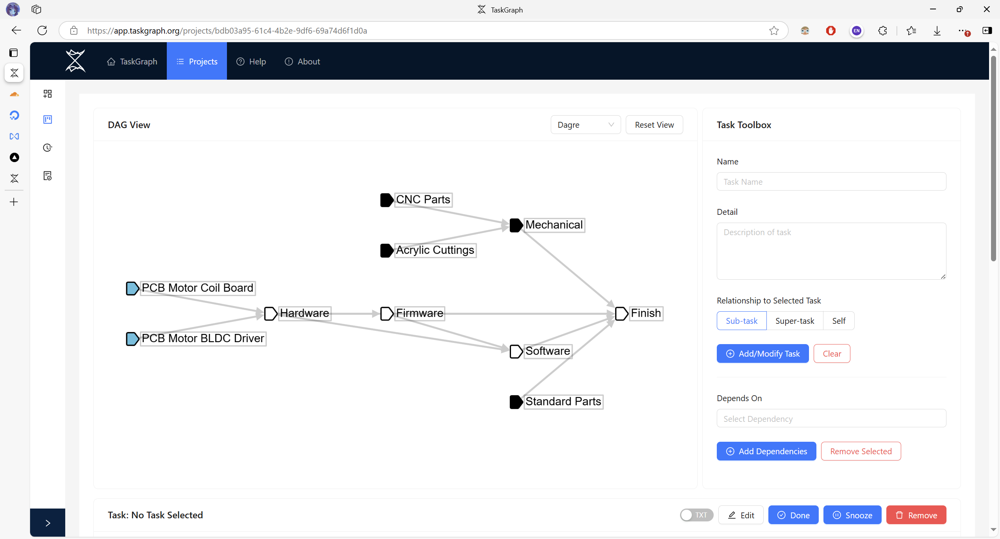
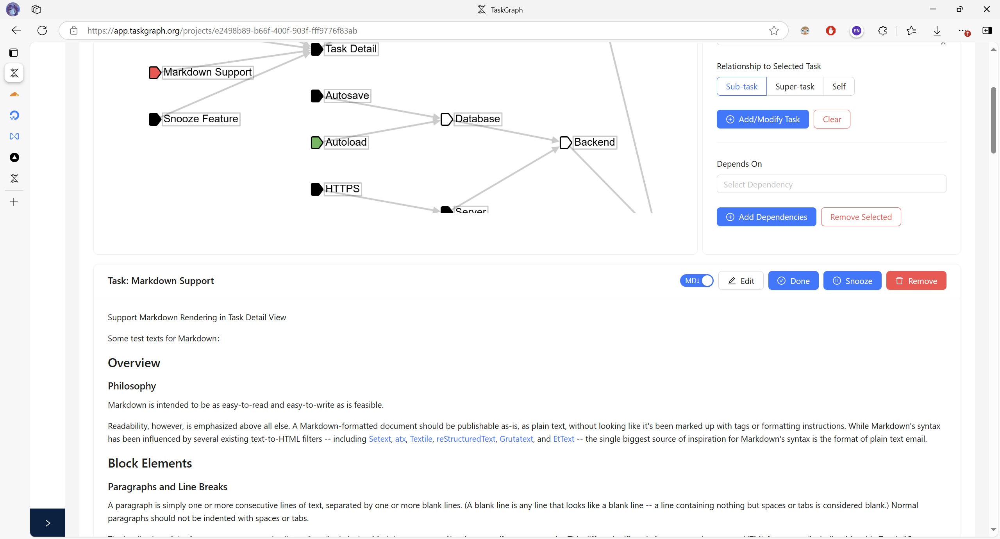
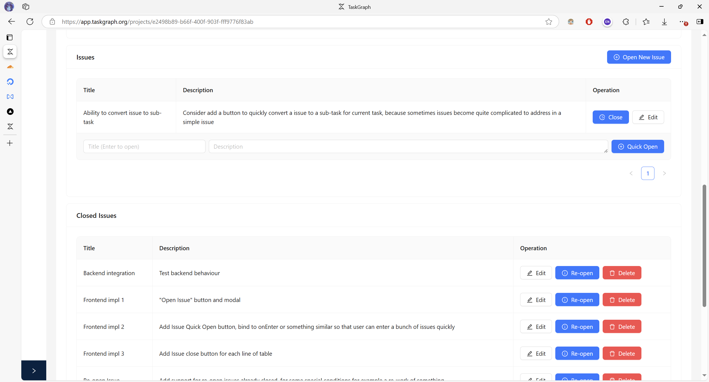

# Screenshots

In TaskGraph, tasks are organized into directed graphs to express dependencies between tasks.
The program automatically analyzes what to do for now.
Active tasks (marked blue in the DAG View) are also grouped and showed in the dashboard.

A variaty of metadata can be attached to each task.
One of the most useful metadata is the Task Detail.
The task detail helps you to organize your thoughts and work,
and can be used as a simple and quick lab log.
Both Markdown and plain text are supported for writing task details.

Another useful metadata attached to each task is the Issues.
For each task, a list of issues can be created.
The issues system helps you to track your progress for each task.

